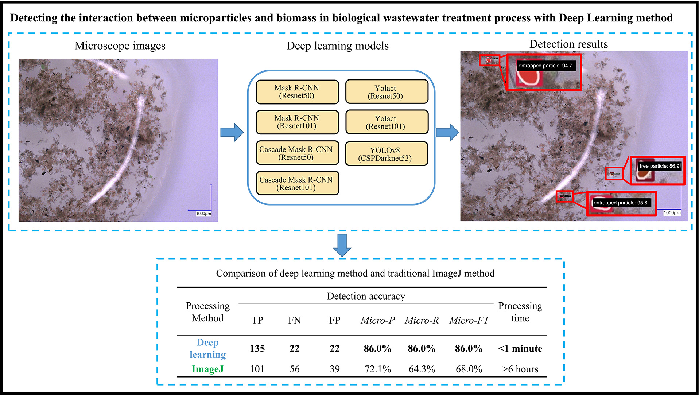

# Detecting the interaction between microparticles and biomass in biological wastewater treatment process with Deep Learning method

This repository contains the code used for the following publication:
```bash
  Jia, T., Peng, Z., Yu, J., Piaggio, A. L., Zhang, S., & de Kreuk, M. K. (2024). Detecting the interaction between microparticles and biomass in biological wastewater treatment process with Deep Learning method. Science of The Total Environment, 175813. doi: 10.1016/j.scitotenv.2024.175813
```

The aim of this code is to use deep learning models to detect the interaction between microparticles and biomass in biological wastewater treatment process.




Acknowledgement:

This project was inspired by an open source project ["MMDetection"](https://github.com/open-mmlab/mmdetection). 
Learn more about MMDetection at [documentation](https://mmdetection.readthedocs.io/en/latest/).

## Dataset

The TUD-IPB dataset is a new labelled dataset for detecting the interaction between microparticles and biomass in biological wastewater treatment process. This dataset and further details can be found in:

```bash
  https://doi.org/10.5281/zenodo.13374998
```

## Installation:

Requirements:
- Windows 10 or Linux
- Python 3.8.16
- Pytorch 1.13.1

(1) Install Pytorch 1.13.1 (CUDA 11.7) (for Windows 10)

```bash
conda install pytorch==1.13.1 torchvision==0.14.1 torchaudio==0.13.1 pytorch-cuda=11.7 -c pytorch -c nvidia
```

(2) Install MMCV using MIM
```bash
pip install -U openmim
mim install mmengine==0.8.4
mim install mmcv==2.0.1
```

(3) Install MMDetection
```bash
mim install mmdet==3.1.0
```

(4) Install other packages

```bash
  pip install -r requirements.txt
```

## Note
This repository only includes the implementation of six model architectures: (1) Mask RCNN (ResNet50), (2) Mask RCNN (ResNet101), (3) Cascade Mask RCNN(ResNet50), (4) Cascade Mask RCNN(ResNet101), (5) Yolact (ResNet50), and (6) Yolact (ResNet101). The implementation of YOLOv8 can be found [here](https://github.com/TianlongJia/deep_pollutant_YoloV8)


## Usage

-  `main_InstanceSeg_train.ipynb` is the code for training deep models for object detection.
-  `main_InstanceSeg_evaluate.ipynb` is the code for (1) evaluating model performances on test sets (e.g., outputing mAP50), (2) predicting objects in images, (3) outputing confusion matrix, and (4) outputing bounding box (bbox) and mask information (e.g., the area of each bbox and mask).

## Citing this dataste or paper

If you find this code and dataset are useful in your research or wish to refer to the paper, please use the following BibTeX entry.

```BibTeX
@article{jia2024detecting,
  title={Detecting the interaction between microparticles and biomass in biological wastewater treatment process with Deep Learning method},
  author={Jia, Tianlong and Peng, Zhaoxu and Yu, Jing and Piaggio, Antonella L and Zhang, Shuo and de Kreuk, Merle K},
  journal={Science of The Total Environment},
  pages={175813},
  year={2024},
  publisher={Elsevier}
}
```

## Authors

- [@Tianlong Jia](https://github.com/TianlongJia)
- [@Jing Yu](https://github.com/yyyuj)


## Contact

➡️ Tianlong Jia ([T.Jia@tudelft.nl](mailto:T.Jia@tudelft.nl))

